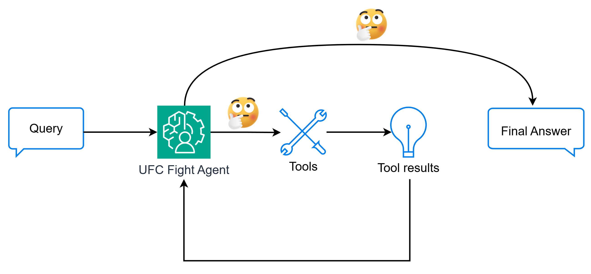

# UFC Fight Recommendation Agent

A tool-using LLM agent built from scratch that provides personalized UFC fight recommendations based on user queries.

## Overview

This project demonstrates how to create a tool-using LLM agent without relying on frameworks. The agent can analyze upcoming UFC events and recommend fights based on natural language queries, leveraging LLM reasoning capabilities.

[Medium Blog](https://medium.com/p/28c409aac46b)



## Features

- Custom tool wrapper with automatic docstring parsing
- Two-phase agent architecture for tool selection and recommendation
- Support for extended thinking capabilities
- UFC data retrieval and analysis

## Project Structure

```
ufc-fight-agent/
├── ufc_agent_demo.ipynb    # Interactive examples and demonstrations
└── ufc_fight_agent/        # Main module containing agent implementation
    ├── __init__.py
    ├── agent.py            # Agent implementation with two-phase workflow
    ├── tool.py             # Tool definition and decorator
    └── ufc_data.py         # UFC data retrieval functions
```

## Usage

See `ufc_agent_demo.ipynb` for examples of how to use the agent, including:
- Getting recommended fights based on preferences
- Analyzing potential upsets
- Exploring upcoming title fights

## Installation

```bash
git clone https://github.com/yourusername/ufc-fight-agent.git
cd ufc-fight-agent
pip install -r requirements.txt
```

## Connect

[LinkedIn](https://www.linkedin.com/in/ytian-aiml/)